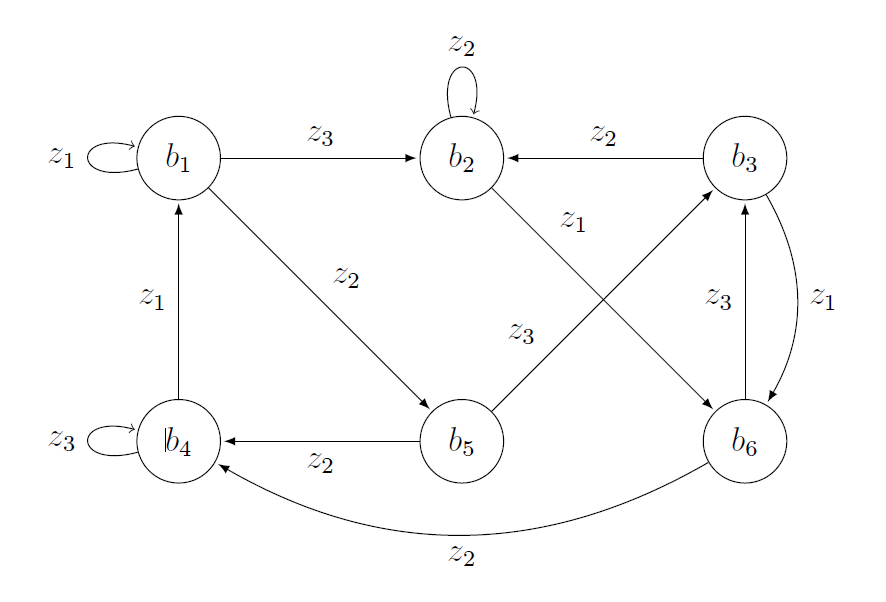
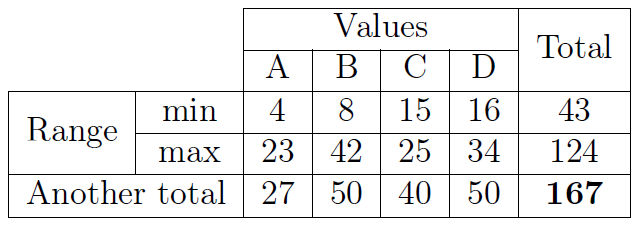

# 7 Лабораторная работа №7. "Работа с системой компьютерной вёрстки TEX"
Задание для данной лабораторной свёрстано с использованием шрифтра по умолчанию системы компьютерной вёрстки TEX для того, чтобы показать отличие от традиционных офисных пакетов. Но при необходимости можно подключить дополнительные пакеты для отображения кегля TimesNewRoman или других. 
## 7.1 Подготовка к работе
1. Скачать и установить любой дистрибутив TEX (например, MiKTeX) или создать
   аккаунт на сайте ShareLaTeX ([sharelatex.com](https://www.sharelatex.com/)), Overleaf ([overleaf.com](https://www.overleaf.com/)) или
   любом аналогичном.
2. Выбрать год и номер журнала "Квант" ([kvant.ras.ru](https://kvant.ras.ru/)) согласно варианту из
   таблицы на последней странице документа. Вариант выбирается как сумма
   последнего числа в номере группы, умноженного на 10, и номера в списке
   группы согласно ISU на текущий день.
3. Выбрать одну страницу из всего номера, отвечающую следующим требованиям:
- Текст должен состоять минимум из 2 колонок.
- Заголовок не должен превышать 20% от площади страницы. 
- Страница должна содержать 1 или 2 картинки, общая площадь которых
   не должна превышать 40% площади страницы.
- Текст должен содержать не менее 2 сложных формул. Желательно, чтобы
   были такие математические операции, как сумма элементов (не путать с
   простым сложением), извлечение корня, логарифм и т.п.
- В тексте должна быть как минимум 1 таблица. Размерность таблицы
   должна превышать 2*2 элемента.

   В случае, если такая страница не найдена, то взять 1.5 страницы, где на одной
   будет б&#243;льшая часть задания, а на оставшейся – меньшая.

  В случае, если и таким образом страница не найдена, необходимо увеличить
     год выпуска на 19 лет и искать материал в новом выпуске. 
## 7.2 Задание
### Обязательное задание (<=75%)
___Вариант №21___

   Сверстать страницу, максимально похожую на выбранную страницу из журнала
   "Квант". 
### Необязательное задание №1 (+10%)
   _Выполнение данного задания позволяет получить до 10 дополнительных процентов
   от максимального числа баллов БаРС за данную лабораторную._
1. Сверстать титульный лист.
2. Создать файл _main.tex_, в котором будет содержаться преамбула и ссылки на 2
   документа: титульный лист и статью (ссылки создаются с помощью команды
   \input).
### Необязательное задание №2 (+15%)

___Вариант №1___

   _Выполнение данного задания позволяет получить до 15 дополнительных процентов
   от максимального числа баллов БаРС за данную лабораторную._
1. Рассчитать номер варианта по следующей схеме:

   _Ф – количество букв в фамилии, И – количество букв в имени_

    _Номер варианта = 1 + ((Ф \* И) mod 8)_
2. Выполнить задание из полученного варианта, используя средства LATEX.
## 7.3 Требования и состав отчёта
1. Отчёт предоставляется только в электронном виде.
2. Свёрстанный документ (_.pdf_).
3. Исходные файлы (_.tex_).
4. Выбранные страницы из журнала "Квант" (картинка или _.html_).

### Необязательное задание №2

___Вариант №1___

В каждом варианте указаны пакеты или классы документов, использование которых
необходимо или полезно для выполнения задания.

__Вариант 1__

Работа с пакетом TikZ
```tex
\usepackage{tikz}

\usetikzlibrary{automata,positioning}
```
Воспроизвести диаграмму состояний (граф переходов) конечного автомата (англ.
_Finite-state machine_). Допускаются различия в расположении подписей над
переходами и во внешнем виде стрелок.



__Вариант 2__

Работа с таблицами
```tex
\usepackage{array}
\usepackage{multirow}
\usepackage{diagbox}
```
Воспроизвести 2 таблицы, приведенные ниже. Допускаются различия в ширине
столбцов. Обратите внимание на то, что во второй таблице столбцы 0 и 2 выделены
__полужирным__ и _курсивом_ соответственно.




__Варианты 3–8__

Создание презентаций с помощью пакета Beamer
```tex
\documentclass{beamer}
```
Используя пакет Beamer, необходимо сверстать 5 слайдов презентации с лекций по
"Информатике". Распределение презентаций и слайдов по вариантам представлено
в таблице ниже. Допускаются отличия в стиле слайдов, внешнем виде таблиц и
шрифтах, однако наличие логотипа на первом слайде обязательно. Основная задача
– воспроизвести _содержание_ слайдов.

| Вариант  | Презентация. Первый слайд                                  | №№ слайдов           |
|----------|------------------------------------------------------------|----------------------| 
| 3        | Лекция 1. Определение термина "Информатика"                | 10, 11, 13, 16, 17   | 
| 4        | Лекции 1. Мера количества информации по Шеннону            | 17-19, 20, 21        |
| 5        | Лекция 1. Перевод из одной СС в другую. Пример 1           | 26, 28, 32-34        |
| 6        | Лекция 1. Оптимальная система счисления (продолжение)      | 35, 37-39, 41        |
| 7        | Лекция 2. Целые числа со знаком в трёхразрядном компьютере | 8-12                 |
| 8        | Лекции 5-6. Офисное программное обеспечение                | 1-3, 5, 6            |

__Используются порядковые номера слайдов__
